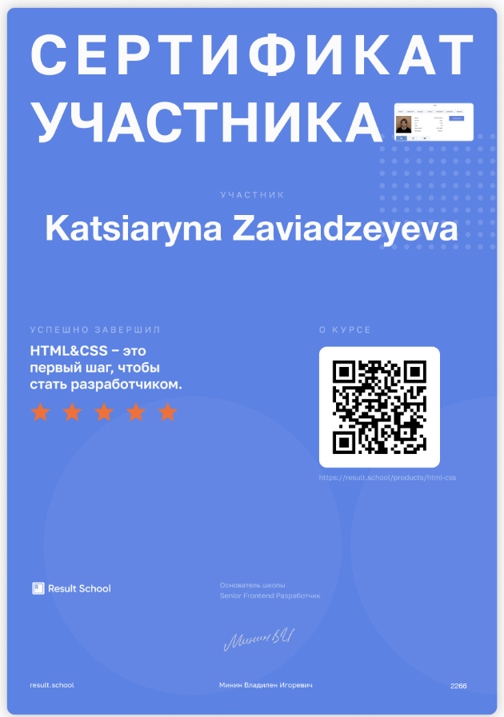
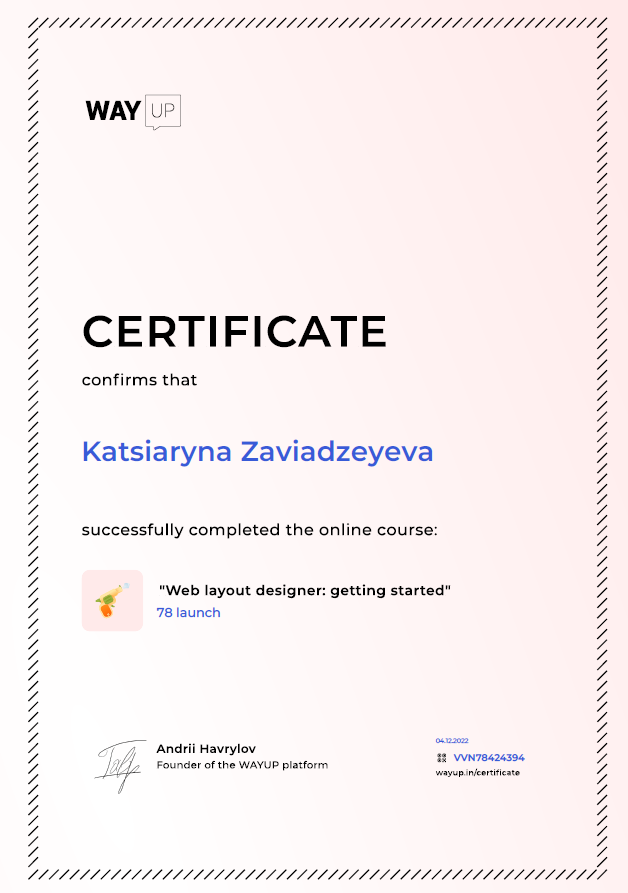
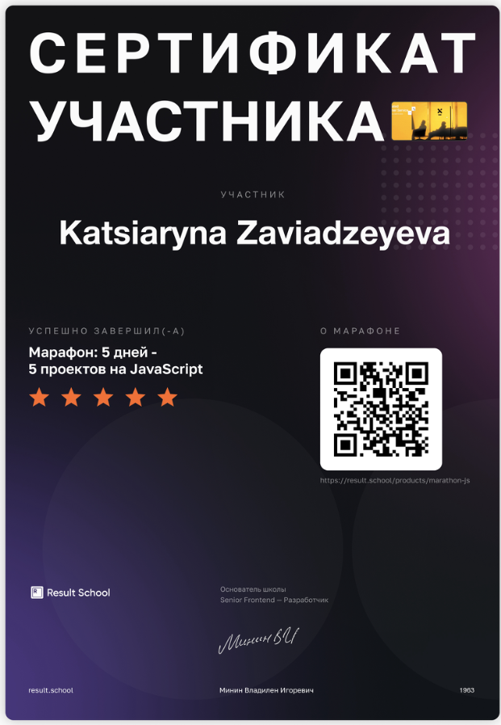
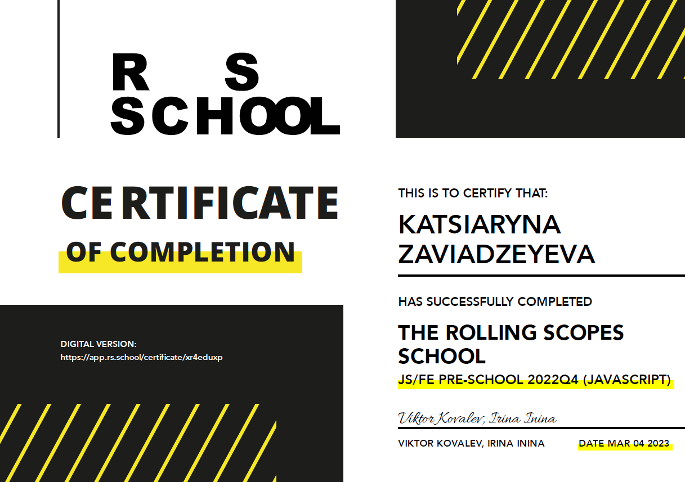

## rsschool-cv
# Katsiaryna Zaviadzeyeva

***
### Contacts
+ **Location:** Dover, United Kingdom
+ **Phone:** +44 7305 345290
+ **Email:** katsiarynaappleby@gmail.com
+ **GitHub:** KatsiarynaZaviadzeyeva
+ **Discord:** Kate (@Katerina Zavedeeva#4234)
***
### About me
My last job was related with interior design. In the process of doing projects, I got acquainted with HTML and CSS, became interested in this and began to deepen my knowledge. I like to learn something new and develop, so I decided to change my profession. I have a lot of desire, drive and enthusiasm to expand my knowledge and improve my skills in software development. I think that rs-school is a great opportunity to fulfill my aspirations and become a sought-after front-end developer
***
### Skills
+ HTML5, CSS3
+ JavaScript (basics)
+ Databases and SQL
+ OOP and Java (basics)
+ Git, GitHub
+ VS Code, NetBeans, Eclipse
***
### Code example
```
function solution(number) {
    let sum = 0;

    for (let i = 1; i < number; i++) {
        if (i % 3 == 0 || i % 5 == 0) {
            sum += i;
         }
    }
    return sum;
}
```
***
### Education
+ 1999 - 2004 Vitebsk State Technological University
    - Manufacturing Engineer
+ 2019 - 2021 Vitebsk State Technological University
    - Software Engineer   
+ HTML and CSS] 
    - http://code.mu/ru/markup/book/prime/
    - https://result.school/products/html-css
    - https://wayup.in/ru/library/course10
      -  
      - 
+ JavaScript 
    - https://learn.javascript.ru/
    - https://code.mu/ru/javascript/book/prime/
    - https://result.school/products/marathon-js
      - 
    - https://rs.school/js/
      -   
***
### Languages
+ Belarusian
+ Russian
+ English А2 - B1 (I'm constantly working on my English and I have some speaking practice with native speakers)